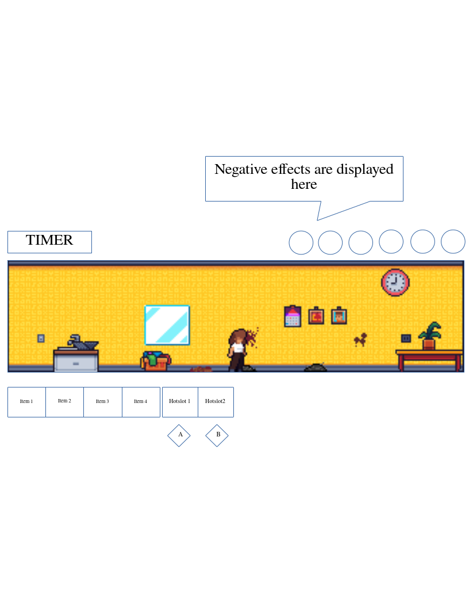

# PROJECT
- *Name*: Oops, I forgot to clean! (OIFTC)
# Overview

## Summary
- OIFTC is a delightful, colorful pixel-art 2D-platformer game where cleaning house never been so chaotic - and fun. You're just a person in a *big, messy* house with only one mission at hand right now: clean it up **FAST** before the mess you left off meets whoever's coming home. But cleaning house, as always, will not be easy but full of challenges and surprises.
- Presenting a colorful pixel art world, where every messes you have to clean tells a story. From stubborn stains, scattered laundry, or a pile of dishes, no two messes are the same, and each comes with its own mechanics and playful minigames, making every cleanup session feel fresh and engaging.
- But this isn’t just about cleaning; it’s about the delightful chaos that comes with it. The house is full of unpredictable twists—toppling furniture, mischievous hazards, and even disasters that will keep you on your toes. There’s always more than one way to tackle the mess, giving players plenty of room for experimentation and fun.

## Theme
- Chaos and Order
_ Relatable humor
- Time pressure
- Charming, lighthearted, endearing

## Genre
- Casual, Time Management, Action-Puzzle Platformer

## Target Audience
- All ages and gender.
- Casual gamer
- Pixel-art lover

## Platform
- PC: Windows and Linux

- Player is tasked with cleaning up various messes around a house.
Each level present a new house (or room). The player must interact with and clean items quickly to achieve the highest score possible.

## Gameplay

### Overview
The core gameplay of each level in OIFTC revolves around *dynamic interactions* between *messes* and *tools*, creating a rich, dynamic and reactive environment. Player have to carefully consider how to approach each mess, as improper use of *tools* can lead to unintended consequences - messes spreading, tools malfunctioning and even dangerous *disaster* forming.

- *Messes*: Anythings that we wouldn't want to see in a clean house - **disorder, dirt, stains, spiils, odors,...**. Your task is to eliminate them as fast as possible. Each mess has unique properties and challenges, requires specific tactics or tools to clean effectively
- *Tools*: Anythings that we use to tackle *messes*. From specialize cleaning equipment like a **broom, mop, sponge, vacuum, washing machines,...**, to improvised items like **papertowels, napkins, toothbrushes, paintbrushes,...**. The only limitation is your imagination

The game encourages experiment and adaptability by coming up with creative solutions while racing against the clock, balancing **speed** and **efficiency**. The reactive, chaotic nature of the environment ensures that every action carry weights, and mistakes can compounds into new challenges, keeping the gameplay engaging and dynamic. Mastery comes from understanding the cause-and-effect relationships between *tools*, *messes* and the environment.

### Rules
#### Goals
- The goal of each level is to clean up the house as much as possible before time runs out.
- The player must clean as efficiently as possible to achiveve the heighest score while preventing diasters and chaos from taking over the house.

#### Winning conditions
- Player earns at least 1 star for each level
- No *disaster* is present by the time the level ends

#### Losing conditions
- 

#### Optional Goals / Achivements
- Find all *hidden socks* in the level
- Find *missing item* in the level

### Core Mechanics

#### Player Action
- Player have
    - An inventory with 4 slots and 2 hot slots
#### Messes
- *Types*: Dust, spills, stains, dishes, laundry,...
- Different types of messes are scattered throughout each level, each require specific tools or combinations of tools to clean
<!---  - Some messes may requires *minigame* (button-prompt, rhythm challenges...) to clean, while others can be cleaned easily by performing basic actions like pressing or hold a button
    --->

- Some messes can be cleaned in more than one way (Dust can be cleaned by broom or vacumm, laundry can be washed by hand or by washing machines, same for dishes)

- Some messes are *critical* and will cause larger problems if not addressed immediately

#### Objects
- Various objects in the house can be interacted with or picked up
- Objects can affect gameplay by giving player some advantages (stats boost, resolve negative effects), or be an obstacle, even create *messes* under certain conditions
- **Examples**: TV, Sink, Fridge, Lamp, Computer, AC... 

#### Disasters
- Certain messes will escalate into *disasters* that are harder to manage, eventually leading to a game over.

- Examples of *disasters*: fires, floods, irreparable damage

#### Tools
- Player is provided with various *cleaning tools* (vacumm, mop, sponge,...) to clean the messes. Each can be bought or upgraded
- Using tools consumes *stamina*
- Tools are classified in two types:
    - *Big*: Powerful, consume less stamina to use but disable both *hot slots* and heavier to carry (reduce speed and have to put down before use other items)
    - *Small*: Lightweight, can be carry but less powerful and consume more stamina to use.

- **Tool Mantenance**
    - Some tools requires external resources (Vacumm need electricity, Washing machines)
    - Tools can get dirty or worn out, requiring cleaning or repair before reuse

- At any given time, player can only carry one big and/or one small tool. If want to swap, player have to put down according tool in hand down first

#### Cleaning-solution and Detergent (AKA CsD)

- **Cleaning-solution** include objects like Lemon, Vinegar, Salt, Cornstarch,...
- **Detergent** include glass-cleaner, stain-remover, dish soap, ...

- *Cleaning-Solutions and Detergents* serve as consumable items that enhance the player's ability to clean efficiently while reducing stamina consumption

#### Player Stats
- Player have basic *stats*: *Speed, Stamina, Cleanliness*

#### Effects
- Player can be applied with various temporary statuses called **effects** when interacting with certain messes or objects.

- *Types*: 
    - *Positive*: Focus, Speed Boost,...
    - *Negative*: Wet, Greasy, Dirty

- *Interaction with Messes and Objects*
    - **Examples**: TV will be broken (emit spark) when interact with wet hands, clean laundry will be dirty again when interacting with dirty hands

#### Cleaning mechanics
- To clean a mess, player interact with it using specific controls with *tools* / *items* in hand

#### Inventory
- Player have 2 slots in hotbar and 4 slots in Inventory for *tools*, *objects* and *items*

#### Scoring
- Player is awarded points for cleaning messes, based on:
    - *Speed and efficiency* of the cleanup
    - *Combo multipliers* can be earned by cleaning multiple messes in quick succession or in an efficient manner
    - *Secondary objectives* like finding *hidden socks* or completing optional tasks give additional rewards (points, multipliers, items...) 
- Points are subtract with each *Critical mess*

### Player Actions and Controls
#### Movement
- Use *arrow keys/WASD* to move the character around the house
#### Interaction

- Option 1
    - *button 1*: Interact with messes and objects
    - *button 2*: Cancel or stop an action 

- Option 2
    - (Hold) *button 1*: Use tool in hand
    - *button 2*: Switch between 2 hot slots
    - *button 3*: Interact with objects
    - (Hold) *button 4*: Drop tool in hand
    - *button 5*: Open Inventory

#### Special
- *button Esc* Pause

### Progression
- Level will progressively introduce more difficult messes, bigger houses, more hazards
- Some events may pop up like party, sudden guests,...

## Visuals and Sounds

### Art Style
- Colorful pixel art style ensure the game has a charming and friendly look

### Sounds
- Fun sounds effect for messes being cleaned, tools being used, power-ups activating,...

### Music
- A catchy background soundtrack

# Details

## Mechanics
### Messes
##### Dust
- Dry particles that can be easily swept by a broom or vacuumed 

##### Stains
- Markings or discolorations caused by food, drinks or other substances
- Need scrubbing by *rags* or *sponges*

##### Spills
- Liquids or semi-liquids that spread across surfaces
- Can cause *Stains* on surfaces and nearby objects if leave for too long
- Can cause player to **slip**
- Need cleaning by *rags* or *mop*

##### Trash
- General garbage, broken items, wrappers,...
- Can cause *Stains* on surfaces and nearby objects if leave for too long
- Need picking up and disposing in a specific bin

##### Laundry
- Clothes or fabrics with stains or dirt
- Need putting in a washing machine  or washing by hands, all requires CsD

##### Dishes
- Plates, glasses, utensils,...
- Need putting in a dish washer or washing by hands, all requires CsD

### Tools
#### Hand-tool

1. Broom:
    
    Performance
    Effective Against: Dust and debris that settle on the floor.
    Repair/Cleaning: No cleaning is required for a broom.
    Capacity: The broom can cover large areas and handle various surfaces but works best on dry debris.

2. Mop:

    Effective Against: Spills and wet messes.
    Repair/Cleaning: Mop heads should be cleaned with water and occasionally replaced if worn out.
    Capacity: Works efficiently on floors but can be cumbersome to carry around.

3. Vacuum:

    Effective Against: Dust, dirt, and small debris on floors and carpets.
    Repair/Cleaning: Requires cleaning of filters and emptying of dust canisters.
    Capacity: Can hold a large amount of dirt, but needs to be emptied periodically.

4. Scrubbing Brush:

    Effective Against: Stubborn stains on various surfaces.
    Repair/Cleaning: Brush heads need cleaning with soap and water.
    Capacity: Ideal for detailed and stubborn stains.

5. Sponge:

    Effective Against: Small spills and light stains.
    Repair/Cleaning: Rinse the sponge with water after use, but replace when worn down.
    Capacity: Good for absorbing small amounts of liquid and cleaning small areas.

6. Microfiber Cloth:

    Effective Against: Light dusting and polishing.
    Repair/Cleaning: Wash with water or detergent to keep effective.
    Capacity: Small but versatile for cleaning surfaces without streaks.

### Cleaning-solutions and Detergent
- *Baking Soda*

